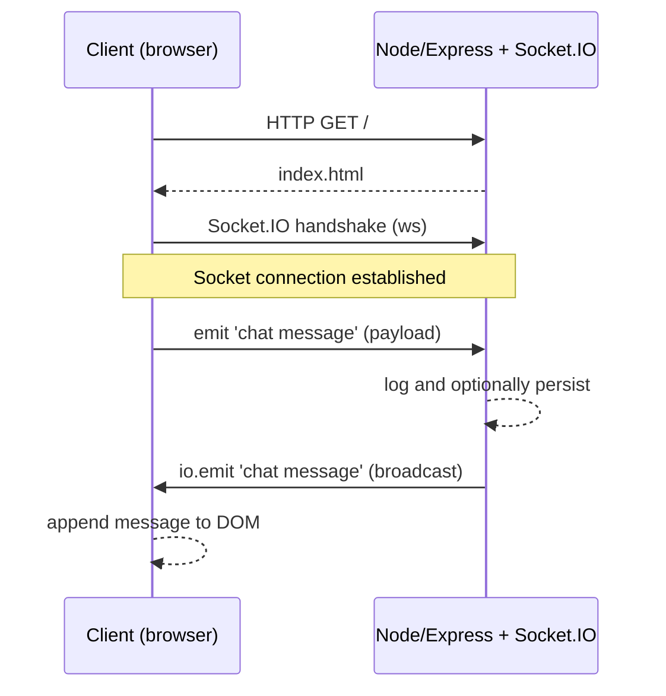
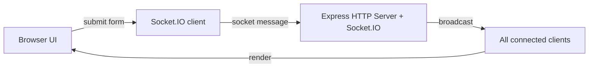

**Overview**

- **Purpose**: This document explains how the small Socket.IO demo works (server ↔ client) and how to run and extend it.
- **App files**: See [index.js](index.js#L1-L80), [index.html](index.html#L1-L140), and [package.json](package.json#L1-L80).

**Quick Start**

- **Install**: Run the dependency install once.

```bash
npm install
```

- **Run**: Start the server (default port 3000). If port 3000 is taken, set `PORT`.

```bash
npm start
# or for live reload while editing (dev):
npm run dev
# specify alternate port:
PORT=3001 npm start
```

**How It Works — High Level**

- **Transport**: Socket.IO uses WebSockets when possible and falls back to other transports when needed.
- **Roles**:
  - **Server**: Accepts HTTP requests and upgrades socket connections; receives `chat message` events and re-broadcasts them.
  - **Client**: Connects to the server, sends `chat message` events and listens for messages to update the DOM.

**Server Flow (sequence)**

1. HTTP GET / serves the static HTML: the route is defined in [index.js](index.js#L1-L80).
2. Socket.IO attaches to the same HTTP server so both HTTP and sockets share the port.
3. When a client emits `chat message`, the server logs it and calls `io.emit('chat message', msg)` to broadcast to all clients — see the connection handler in [index.js](index.js#L18-L26).

**Client Flow (what the browser does)**

- The client loads `/socket.io/socket.io.js` and establishes a socket to the server.
- On form submit the client sends `socket.emit('chat message', value)`.
- The client listens for `chat message` and appends each received message into the `#messages` list — code in [index.html](index.html#L1-L140).

**Code Walkthrough**

- **Server: `index.js`**
  - **Create server**: Uses `createServer(app)` and `new Server(server)` to attach Socket.IO.
  - **Port handling**: Reads `process.env.PORT || 3000` and listens on that port. An `error` handler detects `EADDRINUSE` and exits with a clear message.
  - **Broadcast**: The `io.on('connection', ...)` block is where incoming socket events are handled and rebroadcast.

- **Client: `index.html`**
  - **DOM ready**: Client code runs after DOM is ready to avoid null elements.
  - **Send & receive**: Submits messages via the form and appends incoming messages to the list, scrolling to the bottom for convenience.

**Interactive Sections**

<details>
<summary><strong>Troubleshooting: Port in use</strong></summary>

If you see `EADDRINUSE` (address already in use), either stop the other app using port 3000 or start this app on another port:

```bash
# stop the other app (example on Windows using PowerShell):
Get-Process -Id (Get-NetTCPConnection -LocalPort 3000).OwningProcess | Stop-Process
# or start this app on port 3001:
PORT=3001 npm start
```

</details>

<details>
<summary><strong>Extend it: persistent chat</strong></summary>

To persist messages, add a small in-memory array or a database and emit the stored history to newly connected sockets in the `connection` handler. Example snippet (server-side):

```js
const history = [];
io.on("connection", (socket) => {
  // send recent history
  socket.emit("chat history", history);

  socket.on("chat message", (msg) => {
    history.push({ msg, time: Date.now() });
    io.emit("chat message", msg);
  });
});
```

And on the client, listen for `chat history` and render it.

</details>

**Diagrams**

Below are two simple diagrams (Mermaid) that visualize how the client and server interact and the component flow.

Sequence diagram:



Component flow (flowchart):



If you want these diagrams as PNG/SVG files instead of Mermaid code blocks, I can generate and add them to the repo.

**Commands & Files**

- **Run server**: `npm start` — entry is [index.js](index.js#L1-L80).
- **Dev**: `npm run dev` uses `nodemon` to reload on edits — see [package.json](package.json#L1-L80).

**Design Notes**

- **Why broadcast from server?** Broadcasting from the server ensures all connected clients receive new messages, even those that did not originate the message.
- **Why share port?** Attaching Socket.IO to the HTTP server keeps the web app and socket endpoint on the same origin, avoiding CORS complexity.

**Files to inspect**

- [index.js](index.js#L1-L80)
- [index.html](index.html#L1-L140)
- [package.json](package.json#L1-L80)

**Want me to:**

- Create a screenshot or Mermaid sequence diagram? Reply with which one you prefer.
